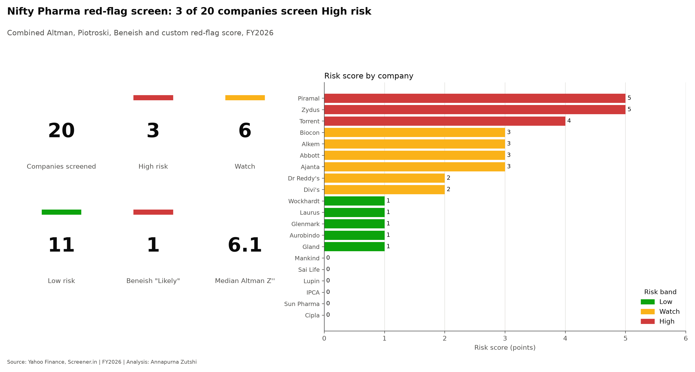
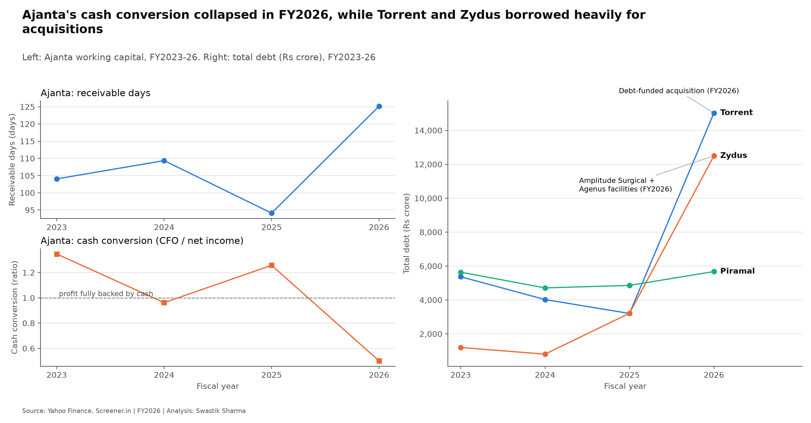

# Nifty Pharma Financial Red-Flag Screener

Screens 20 Nifty Pharma companies for financial distress and earnings-manipulation risk, using Altman Z'', Piotroski F-score, Beneish M-score and five custom red flags.

`Python` | `pandas` | `openpyxl` | `matplotlib` | `pytest`



## Key findings

- 3 of 20 Nifty Pharma companies screen High risk: Piramal, Zydus and Torrent; two of them because of acquisitions.
- 17 of 20 companies are financially Safe on Altman Z''; Torrent, Piramal and Biocon sit in the Grey zone.
- Piramal is the only company that is both financially weak and weakening, with interest cover of just 0.48x.
- Only Abbott crosses the Beneish manipulation threshold, and the driver (deposit reclassification) looks benign.
- Ajanta shows genuine working-capital deterioration: receivable days 94 -> 125 and cash conversion collapsing.
- Six companies trigger no red flags: Mankind, Sai Life, Lupin, IPCA, Sun Pharma and Cipla.

## Deliverables

| Deliverable | Description |
|---|---|
| [`reports/sector_note.pdf`](reports/sector_note.pdf) | Written sector note with the full analysis |
| [`outputs/red_flag_watchlist.xlsx`](outputs/red_flag_watchlist.xlsx) | Ranked Excel watchlist, all 20 companies |
| [`outputs/charts/`](outputs/charts/) | 7 charts supporting the analysis |

## What it does

- Screens 20 Nifty Pharma companies, scoring FY2026 (with FY2025 as a secondary year) using data pulled from Yahoo Finance.
- Computes Altman Z'' (bankruptcy/distress risk), Piotroski F-score (fundamental strength) and Beneish M-score (earnings-manipulation risk) for every company.
- Computes five custom red flags (F1-F5) tailored to working-capital and debt-stress patterns specific to this sector.
- Combines all of the above into one risk score and risk band (Low / Watch / High) per company, ranked into a single watchlist.
- Every number was checked against [Screener.in](https://www.screener.in) and the Python calculations were verified by hand against a manual Excel model of Cipla.

## Methodology

### The three scores

| Score | What it measures | Zones / thresholds |
|---|---|---|
| **Altman Z''** | Overall bankruptcy/distress risk, combining liquidity, profitability, leverage and sales efficiency | Safe: Z'' > 2.6 · Grey: 1.1 ≤ Z'' ≤ 2.6 · Distress: Z'' < 1.1 |
| **Piotroski F-score** | Fundamental financial strength across profitability, leverage/liquidity and operating efficiency (9 yes/no tests) | Strong: 8-9 · Average: 4-7 · Weak: 0-3 |
| **Beneish M-score** | Likelihood of earnings manipulation, from 8 accounting ratio indices | Likely: M > -1.78 · Watch: -2.22 < M ≤ -1.78 · Unlikely: M ≤ -2.22 |

### The five custom red flags

| Flag | Trigger |
|---|---|
| **F1** Receivables outpacing sales | Receivables growth exceeds revenue growth by more than 10 points (FY2026 vs FY2025) |
| **F2** Weak cash conversion | At least 2 of the last 3 years have operating cash flow below net income |
| **F3** Inventory buildup | Change in inventory days (FY2026 vs FY2025) is more than 15 days above the *sector median* change |
| **F4** Debt stress | Total debt rose, interest coverage fell, and total debt exceeds 10% of equity in FY2026 |
| **F5** Low interest cover | Interest coverage below 1.5x |

### Adaptations made along the way

- **Piotroski's leverage test** treats a company with zero long-term debt in both years as passing, rather than penalising it for an undefined leverage ratio.
- **Piotroski's share-issuance test** tolerates share counts rising by less than 1% year on year, since small increases are usually employee share schemes rather than new equity raises.
- **Beneish's "Watch" zone** was added between "Likely" and "Unlikely" because Ajanta (M = -1.80) and Abbott (M = -1.66) sit right at the standard -1.78 cutoff — a single hard line would flag them based on a rounding-sized difference.
- **F3 (inventory buildup)** was redefined from a fixed "+15 days vs. own prior year" rule to "+15 days above the sector's median change", after the fixed rule turned out to flag companies simply for following a sector-wide inventory build-up (median change: +13.5 days). The relative rule cut F3 flags from 9 companies to 6.

Full reasoning and every data-gap decision (missing fields, substituted values, roll-forwards) is recorded in [`DECISIONS.md`](DECISIONS.md).

## Case studies



**Piramal Pharma** — the only company that is both financially weak (Altman Grey, Z'' = 1.95) and weakening (Piotroski F = 3). Debt has stayed roughly flat at ₹5,000-5,700 crore for four years; the real problem is that EBIT covers less than half of interest expense (0.48x), triggering a High risk score of 5.

**Zydus Lifesciences & Torrent Pharmaceuticals** — both screen High risk largely because of FY2026 acquisitions. Zydus acquired 85.6% of Amplitude Surgical (France) and Agenus' biologics manufacturing facilities (USA), pushing borrowings from ₹3,213 crore to ₹12,496 crore. Torrent acquired a 46.39% stake in JB Chemicals & Pharmaceuticals, partly bond-funded, with borrowings jumping from ₹3,202 crore to ₹15,026 crore. Their receivables/inventory flags are partly consolidation artifacts, but the leverage increases are real and worth monitoring going forward.

**Ajanta Pharmaceuticals** — the clearest case of genuine (non-acquisition) deterioration: receivable days rose from 94 to 125 and CFO/EBIT collapsed from 96% to 38%, cross-checked against Screener.in's receivables and sales-growth figures. Borrowings also rose from ₹47 crore to ₹260 crore.

**Abbott India** — the only company to cross the Beneish manipulation threshold (M = -1.66, "Likely"). The driver is mainly the asset-quality index (AQI): current and non-current assets moved in opposite directions while their total grew steadily — consistent with a benign reclassification of deposits by maturity, not manipulation. Flagged as a probable false positive, to be confirmed against the annual report.

## Data quality and decisions

Yahoo Finance had gaps for several companies (missing long-term debt, SG&A, depreciation and retained-earnings figures). Every gap was resolved with an explicit, logged decision rather than an invented number — missing fields are left as `NaN`. Full details, including verification against Screener.in for each substitution, are in [`DECISIONS.md`](DECISIONS.md).

## Testing

- All financial-ratio and scoring logic was independently checked against a hand-built Excel model of Cipla: [`reports/manual_check_CIPLA.xlsx`](reports/manual_check_CIPLA.xlsx).
- 67 automated pytest tests cover ratios, scores, red flags and the Excel export, and all 67 pass.

## Project structure

```
data/                         Small, committed input files (reproducible from these)
  nifty_pharma_list.csv       Official Nifty Pharma constituents list (hand-downloaded, never edited)
  companies.csv               Ticker list built from the above
  analyst_notes.csv           Analyst commentary joined into the final watchlist
  manual_overrides.csv        Manual data-gap fixes applied during cleaning
  key_findings.txt            Headline findings, also shown above
data/raw/                     Auto-downloaded Yahoo Finance statements (gitignored, re-created by fetch_financials.py)
data/processed/               Cleaned tables, ratios, scores, final risk-ranked table
src/                           Pipeline scripts: prepare_companies, fetch_financials, clean_financials,
                               ratios, scores, flags, export_excel, build_sector_note, chart_style
notebooks/                     01_explore.ipynb (data-gap exploration) and 02_analysis.ipynb (charts)
tests/                         pytest suite for ratios, scores, flags and the Excel export
outputs/                       Generated Excel watchlist and chart PNGs
  charts/                      7 chart PNGs used in this README and the sector note
reports/                       Sector note (PDF/Word/Markdown) and the manual Cipla check
main.py                        Runs the whole pipeline end to end
DECISIONS.md                   Every data-gap decision, with reasoning and verification
```

## How to run

```bash
git clone <this-repo-url>
cd red-flag-screener
```

Create and activate a virtual environment:

```powershell
# Windows (PowerShell)
python -m venv .venv
.venv\Scripts\Activate.ps1
```

```bash
# Mac/Linux
python3 -m venv .venv
source .venv/bin/activate
```

Install dependencies and run the pipeline:

```bash
pip install -r requirements.txt
python main.py
```

Already have financial data downloaded and just want to re-run the analysis without hitting Yahoo Finance again?

```bash
python main.py --skip-fetch
```

## Limitations

- Relies on Yahoo Finance as the sole data source; several fields had to be substituted or manually verified (see [`DECISIONS.md`](DECISIONS.md)) because Yahoo's coverage of Indian filings has gaps.
- Scores and flags are a single-year (FY2026) snapshot, not a multi-year trend study beyond the ratios that explicitly compare two years.
- The sector-relative thresholds (e.g. F3's inventory-day cutoff) are calibrated on these 20 companies only and would need recalibrating for a different sector or company set.
- This is a screening tool, not a valuation or credit model — a flag means "investigate further," not "sell" or "default imminent."

## Author

Annapurna Zutshi

*For educational purposes only; not investment advice.*
